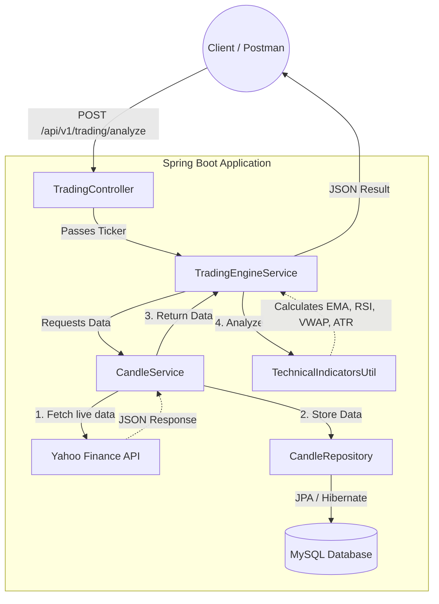

# Quantitative Trading System Architecture & Flow

## 1. Project Overview
This project is a fully automated, conservative quantitative swing trading REST API backend built in **Java 17** and **Spring Boot**. The system dynamically fetches real-time market data, processes historical daily candles, and applies strict technical algorithms to generate a safe "BUY" or "HOLD" decision along with precise entry, target, and stop-loss metrics.

---

## 2. System Architecture

The application is built using a clean, layered architecture (Controller -> Service -> Repository/Domain).

---

## 3. Request Execution Flow

When a user requests analysis for a stock (e.g., `{"ticker": "INFY"}`), the data flows as follows:

1. **Request Intake**: `TradingController.java` receives the JSON request and validates the ticker payload.
2. **Data Ingestion (`CandleService.java`)**: 
   - The engine first clears outdated historical dummy data for the requested ticker.
   - It silently reaches out to the live Yahoo Finance API (`https://query1.finance.yahoo.com/v8/finance/chart/INFY.NS?interval=1d&range=2y`).
   - It parses the raw JSON, converting the arrays of timestamps, open, close, high, and low into cleanly structured Java `Candle` objects.
   - These candles are stored persistently in the MySQL database via `CandleRepository`.
3. **Algorithmic Processing (`TradingEngineService.java`)**:
   - The engine loads the freshly stored historical dataset.
   - It passes the dataset to `TechnicalIndicatorsUtil.java` to crunch the math natively (no third-party heavy math libraries).
   - It runs the 4 strict filters (Detailed below).
4. **Response Assembly**:
   - Depending on the math, it calculates precise execution metrics (Stop Loss, Targets) and generates a human-readable English reasoning string.
   - A perfectly structured `AnalysisResponse` DTO is returned back to the client.

---

## 4. Algorithmic Logic & Filters

The quantitative engine is designed strictly for **Conservative Swing Trading**. It prioritizes capital preservation over high risk. A stock must pass **ALL FOUR** filters to trigger a "BUY" signal.

### Filter 1: Macro Safety Guard (Trend)
- **Logic**: Current Price > 200-day Exponential Moving Average (EMA).
- **Reasoning**: We never "catch a falling knife". The stock must be structurally in a long-term uptrend to minimize macro risk.

### Filter 2: Anti-FOMO Guard (Momentum)
- **Logic**: 14-period Relative Strength Index (RSI) must be between **42 and 55**.
- **Reasoning**: 
  - If RSI > 60: The stock is running too hot (FOMO risk, prone to pullback).
  - If RSI < 40: The stock has lost momentum and is too weak.
  - 42-55 is the "Goldilocks Zone" where institutions are quietly accumulating before a breakout.

### Filter 3: Volume & Value Alignment
- **Logic**: Current Price is within a +/- 2% band of the 20-day EMA **AND** safely above the daily VWAP (Volume Weighted Average Price).
- **Reasoning**: Ensures we are buying near short-term institutional value rather than chasing over-extended retail spikes.

### Filter 4: Risk Mitigation & Early Profit Take (ATR)
- **Logic**: Computes the 14-period Average True Range (ATR) to size the trade.
  - **Stop Loss** = `Current Price - (1.5 * ATR)`
  - **Target** = `Current Price + (1.5 * ATR)`
- **Reasoning**: Enforces a strict 1:1.5 Risk-Reward ratio. Instead of aiming for massive unrealistic gains, this targets highly probable, fast mean-reversion wins.

---

## 5. Built-in Utilities
- **`GlobalExceptionHandler`**: Intercepts calculation errors globally, ensuring the client receives clean 400/422/500 JSON errors instead of raw server crashes.
- **Dedicated File Logging (`SLF4J`)**: Generates an exact trace of every data fetch, math calculation, and API endpoint trigger into `stock_logs/trading_api.log` to allow developers to trace exactly why a specific trade was rejected.
