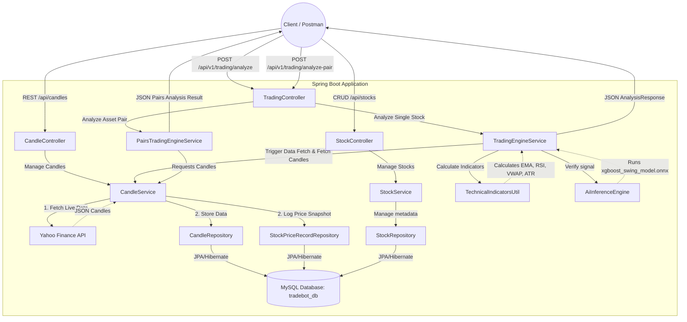

# Quantitative Trading System Architecture & Flow

## 1. Project Overview
This project is a fully automated, conservative quantitative swing trading and pairs trading REST API backend built in **Java 17** and **Spring Boot 3.x**. The system dynamically fetches real-time market data from the Yahoo Finance API, processes historical daily candles, persists data in a MySQL database, and applies strict technical indicators combined with machine learning (ONNX-based XGBoost inference) to generate safe "BUY", "SHORT", "LONG", or "HOLD" decisions along with execution metrics.

Additionally, the system maintains a persistent snapshot log of stock price history (`StockPriceRecord`) every time market data is fetched. This historic record enables users to compare historical price checks over time.

---

## 2. System Architecture

The application is built using a clean, layered architecture: **Controller -> Service -> Repository -> JPA Entities/Database**.



---

## 3. Data Model & Entities

The persistence layer consists of three JPA entities mapped to MySQL database tables under the `tradebot_db` schema:

1. **[Stock.java](file:///d:/AKASH/TradeBot/aitradebot/src/main/java/com/aitrade/aitradebot/entity/Stock.java)**: Represents the stock metadata.
   - `id` (Long, Primary Key, Auto-increment)
   - `stockName` (String)
   - `stockCode` (String)
2. **[Candle.java](file:///d:/AKASH/TradeBot/aitradebot/src/main/java/com/aitrade/aitradebot/entity/Candle.java)**: Represents a historical daily price bar.
   - `id` (Long, Primary Key, Auto-increment)
   - `stockCode` (String)
   - `timeFrame` (String, e.g., "1D")
   - `openPrice` (Double)
   - `closePrice` (Double)
   - `highPrice` (Double)
   - `lowPrice` (Double)
   - `volume` (Long)
   - `candleTime` (LocalDateTime, automatically populated via `@CreationTimestamp`)
3. **[StockPriceRecord.java](file:///d:/AKASH/TradeBot/aitradebot/src/main/java/com/aitrade/aitradebot/entity/StockPriceRecord.java)**: Represents a persistent log of a stock's historical price and technical indicators captured at the time of each fetch. This table acts as a long-term query history for price comparison.
   - `id` (Long, Primary Key, Auto-increment)
   - `stockCode` (String)
   - `date` (LocalDateTime) - Trading day timestamp of the price snapshot
   - `price` (Double) - Close price of the latest daily candle
   - `rsi` (Double) - Calculated 14-period RSI
   - `ema20` (Double) - Calculated 20-day EMA
   - `ema200` (Double) - Calculated 200-day EMA
   - `volume` (Long) - Volume of the latest daily candle
   - `ema20Distance` (Double) - Percentage distance to EMA20: `(Price - EMA20) / EMA20 * 100`
   - `volumeRatio` (Double) - Ratio of volume to 10-day average volume
   - `target` (Integer) - 1 if the trading engine confirms a BUY signal, 0 otherwise
   - `fetchTime` (LocalDateTime, automatically populated via `@CreationTimestamp`)

---

## 4. API Endpoint Directory

The REST interface exposes the following endpoints:

| Controller | Method | Endpoint | Request Payload | Description |
| :--- | :--- | :--- | :--- | :--- |
| **[TradingController](file:///d:/AKASH/TradeBot/aitradebot/src/main/java/com/aitrade/aitradebot/controller/TradingController.java)** | `POST` | `/api/v1/trading/analyze` | `{"ticker": "INFY"}` | Evaluates a single stock against deterministic filters and ONNX AI confirmation. Returns entry price range, target, and stop loss. |
| | `POST` | `/api/v1/trading/analyze-pair` | `{"tickerA": "RELIANCE", "tickerB": "HDFCBANK"}` | Computes the beta-hedged spread Z-Score to output a pairs-trading arbitrage signal. |
| **[StockController](file:///d:/AKASH/TradeBot/aitradebot/src/main/java/com/aitrade/aitradebot/controller/StockController.java)** | `GET` | `/api/hello` | *None* | Verifies API connectivity. Returns confirmation message. |
| | `POST` | `/api/stocks` | Stock metadata JSON | Creates a new Stock record in the database. |
| | `GET` | `/api/stocks` | *None* | Lists all registered stock metadata. |
| | `GET` | `/api/stocks/{id}` | *None* | Fetches stock details by its database ID. |
| | `PUT` | `/api/stocks/{id}` | Stock metadata JSON | Updates stock details. |
| | `DELETE` | `/api/stocks/{id}` | *None* | Deletes stock metadata. |
| **[CandleController](file:///d:/AKASH/TradeBot/aitradebot/src/main/java/com/aitrade/aitradebot/controller/CandleController.java)** | `POST` | `/api/candles` | Candle data JSON | Manually inserts a candle. |
| | `GET` | `/api/candles/{stockCode}` | *None* | Fetches all daily candles currently saved for the given ticker. |
| | `GET` | `/api/candles/bullish/{stockCode}` | *None* | Retrieves only bullish candles (Close Price > Open Price). |
| | `GET` | `/api/candles/latest/{stockCode}` | *None* | Returns the most recent candle along with close-open movement. |
| | `GET` | `/api/candles/price-history/{stockCode}` | *None* | Retrieves the persistent log of all historically fetched price snapshots (including Date, Price, RSI, EMA20, EMA200, Volume, EMA20_DISTANCE, VOLUME_RATIO, TARGET) for comparison. |

---

## 5. Comprehensive Logical Flow Chart

The diagram below details the execution path for both quantitative analysis flows, highlighting data synchronization, processing steps, mathematical validations, and outputs:

```mermaid
flowchart TD
    %% Colors and Styles
    classDef startEnd fill:#f39c12,stroke:#d35400,stroke-width:2px,color:#fff;
    classDef process fill:#3498db,stroke:#2980b9,stroke-width:2px,color:#fff;
    classDef decision fill:#9b59b6,stroke:#8e44ad,stroke-width:2px,color:#fff;
    classDef io fill:#1abc9c,stroke:#16a085,stroke-width:2px,color:#fff;
    classDef error fill:#e74c3c,stroke:#c0392b,stroke-width:2px,color:#fff;

    Start([Client Request Ingested]) :::startEnd --> SelectPath{Route Matches?} :::decision
    
    %% PATH A: Single Asset Analysis
    SelectPath -->|POST /v1/trading/analyze| ReqSingle[Parse Ticker Symbol] :::io
    ReqSingle --> IngestSingle[Trigger CandleService Ingestion] :::process
    
    %% PATH B: Pairs Trading Analysis
    SelectPath -->|POST /v1/trading/analyze-pair| ReqPair[Parse TickerA & TickerB] :::io
    ReqPair --> IngestPairA[Trigger Ingestion for TickerA] :::process
    IngestPairA --> IngestPairB[Trigger Ingestion for TickerB] :::process
    
    %% Yahoo Ingestion Sub-Flow
    subgraph Ingestion [Yahoo Finance Data Synchronization]
        IngestSingle & IngestPairB --> CleanDummy[Delete Existing Local Candle Data] :::process
        CleanDummy --> RequestYahoo[Request Yahoo Finance JSON API <br/> 2 Years, 1D Interval] :::io
        RequestYahoo --> ValidateResponse{Data Available?} :::decision
        ValidateResponse -->|No| LogWarn[Log Warning / Skip Save] :::error
        ValidateResponse -->|Yes| ParseArrays[Extract Arrays of Open, Close, High, Low, Volume] :::process
        ParseArrays --> MapEntities[Convert to Candle Entities and Persist] :::process
        MapEntities --> CalcIndicators[Calculate Indicators on Ingested List: <br/> RSI, EMA20, EMA200, EMA20_DISTANCE, VOLUME_RATIO] :::process
        CalcIndicators --> ConfirmTarget[Evaluate Target Signal: <br/> Deterministic Filters + ONNX Inference] :::process
        ConfirmTarget --> SavePriceRecord[Create and Save StockPriceRecord Snapshot] :::process
    end
    
    %% Core Single Asset Engine
    SavePriceRecord --> ReturnSingle[Return Ticker Candle List to Engine] :::process
    ReturnSingle --> CheckDataLength{Candle Size >= 200?} :::decision
    CheckDataLength -->|No| ErrLen[Throw IllegalStateException <br/> HTTP 422 Unprocessable Entity] :::error
    CheckDataLength -->|Yes| CalcMath[Calculate Indicators: <br/> 200 EMA, 20 EMA, 14 RSI, Daily VWAP, 14 ATR] :::process
    
    CalcMath --> Filter1{Filter 1: Trend <br/> Price > 200 EMA?} :::decision
    Filter1 -->|No| SignalHold[Set Decision: HOLD] :::io
    Filter1 -->|Yes| Filter2{Filter 2: Momentum <br/> 42 <= RSI <= 55?} :::decision
    
    Filter2 -->|No| SignalHold
    Filter2 -->|Yes| Filter3{Filter 3: Volume & Value Alignment <br/> Price within +/-2% of 20 EMA <br/> & Price > VWAP?} :::decision
    
    Filter3 -->|No| SignalHold
    Filter3 -->|Yes| ConfirmAI[Run ONNX Model Inference <br/> features: rsi, distEma20, distEma200, volDelta] :::process
    
    ConfirmAI --> AICheck{Model Probability >= 0.65?} :::decision
    AICheck -->|No| SignalHoldAI[Set Decision: HOLD <br/> 'AI flagged downside structural variance'] :::io
    AICheck -->|Yes| SignalBuy[Set Decision: BUY] :::io
    
    SignalBuy --> CalcTargets[Compute Stop Loss & Target Price <br/> Target = Price + 1.5*ATR <br/> StopLoss = Price - 1.5*ATR] :::process
    CalcTargets --> RespondSingle[Construct AnalysisResponse DTO] :::process
    SignalHold & SignalHoldAI --> RespondSingle
    RespondSingle --> ReturnClientSingle[Return JSON HTTP 200] :::startEnd
    
    %% Core Pairs Trading Engine
    SavePriceRecord --> ReturnPair[Return Timelines A & B to Pairs Engine] :::process
    ReturnPair --> AlignData[Align Historical Timelines by Matching Dates] :::process
    AlignData --> CheckOverlap{Overlapping Candles >= 30?} :::decision
    CheckOverlap -->|No| ErrOverlap[Return Error Response: <br/> Insufficient Overlapping Data] :::error
    CheckOverlap -->|Yes| CalcSpread[Compute Spread & Z-Score <br/> Spread = PriceA - 1.08*PriceB <br/> Z-Score = Spread - 12.45 / 4.12] :::process
    
    CalcSpread --> CheckZScore{Z-Score Boundaries?} :::decision
    CheckZScore -->|zScore >= 2.0| DecisionShortA[Decision: SHORT_A_LONG_B <br/> Spread historically too wide] :::io
    CheckZScore -->|zScore <= -2.0| DecisionLongA[Decision: LONG_A_SHORT_B <br/> Spread historically too compressed] :::io
    CheckZScore -->|Other| DecisionHoldPair[Decision: HOLD <br/> Spread within bounds] :::io
    
    DecisionShortA & DecisionLongA & DecisionHoldPair --> RespondPair[Construct Pairs Analysis JSON] :::process
    RespondPair --> ReturnClientPair[Return JSON HTTP 200] :::startEnd
    
    %% Error Handlers
    ErrLen --> GlobalException[GlobalExceptionHandler Maps to Error Payload] :::error
    ErrOverlap --> ReturnClientPair
    GlobalException --> ReturnClientErr[Return Error JSON] :::startEnd
```

---

## 6. Mathematical Formulations & Indicator Logic

Calculations are computed natively in **[TechnicalIndicatorsUtil.java](file:///d:/AKASH/TradeBot/aitradebot/src/main/java/com/aitrade/aitradebot/util/TechnicalIndicatorsUtil.java)** without any heavy third-party mathematical libraries.

### 6.1 Exponential Moving Average (EMA)
The EMA gives higher weight to recent prices. It is calculated recursively as follows:

$$\text{Multiplier} = \frac{2}{\text{Periods} + 1}$$

$$\text{EMA}_t = (\text{Close}_t - \text{EMA}_{t-1}) \times \text{Multiplier} + \text{EMA}_{t-1}$$

- **Macro Trend Guard**: Uses a **200-day EMA**. Price must be above this value to indicate a macro uptrend.
- **Value Alignment**: Uses a **20-day EMA**. Price must hover within a $\pm 2\%$ range of this line to prevent buying over-extended spikes.

### 6.2 Relative Strength Index (RSI)
RSI measures the velocity and magnitude of directional price movements over a 14-period lookback window.

$$\text{RS} = \frac{\text{Average Gain}}{\text{Average Loss}}$$

$$\text{RSI} = 100 - \left(\frac{100}{1 + \text{RS}}\right)$$

- **Goldilocks Zone (42–55)**: This range indicates quiet institutional accumulation during consolidation or early breakout recovery. RSI values above 60 indicate retail FOMO risk (overbought), and values below 40 represent a severe lack of buyer momentum.

### 6.3 Daily Volume-Weighted Average Price (VWAP)
Since intraday tick data is not stored, the daily VWAP is mathematically approximated using the typical price of the daily candle:

$$\text{VWAP}_{\text{daily}} = \frac{\text{High} + \text{Low} + \text{Close}}{3}$$

- **Execution Rule**: Current price must reside above this intraday value to confirm immediate buying conviction.

### 6.4 Average True Range (ATR) & Sizing
ATR measures historical volatility. True Range (TR) is the maximum absolute value among:
1. Current High $-$ Current Low
2. $\lvert\text{Current High} - \text{Previous Close}\rvert$
3. $\lvert\text{Current Low} - \text{Previous Close}\rvert$

$$\text{ATR}_{14} = \frac{\sum_{i=1}^{14} \text{TR}_i}{14}$$

- **Trade Sizing Metrics**:
  - **Stop Loss** = $\text{Current Price} - (1.5 \times \text{ATR})$
  - **Target Price** = $\text{Current Price} + (1.5 \times \text{ATR})$
  - This ensures a strict **1:1.5 Risk-to-Reward ratio** tailored to historical volatility.

---

## 7. Machine Learning Confirmation (ONNX Runtime)

In addition to deterministic rules, a machine learning confirmation step is implemented inside **[AiInferenceEngine.java](file:///d:/AKASH/TradeBot/aitradebot/src/main/java/com/aitrade/aitradebot/service/AiInferenceEngine.java)**.

- **ONNX Model**: An XGBoost swing trading classifier (`xgboost_swing_model.onnx`) is loaded from the classpath resources during initialization (`@PostConstruct`).
- **Features Extracted**:
  1. `rsi`: 14-period Relative Strength Index.
  2. `distanceToEma20`: Relative distance to the 20-day EMA: $\frac{\text{Price} - \text{EMA}_{20}}{\text{EMA}_{20}}$
  3. `distanceToEma200`: Relative distance to the 200-day EMA: $\frac{\text{Price} - \text{EMA}_{200}}{\text{EMA}_{200}}$
  4. `volDelta`: Volume acceleration compared to the 10-day average volume: $\frac{\text{Volume}_{\text{latest}} - \text{Volume}_{\text{avg10}}}{\text{Volume}_{\text{avg10}}}$
- **Decision Boundary**: The model outputs probability scores. If the probability of class 1 (BUY) is $\ge 0.65$, the signal is approved. Otherwise, the engine downgrades the decision to "HOLD".

---

## 8. Pairs Trading Cointegration Logic

the **[PairsTradingEngineService.java](file:///d:/AKASH/TradeBot/aitradebot/src/main/java/com/aitrade/aitradebot/service/PairsTradingEngineService.java)** executes statistical arbitrage on two assets.

1. **Timeline Synchronization**: Matches history by date, ensuring at least **30 overlapping candles**.
2. **Spread Calculation**: Computes the price spread utilizing a fixed hedge ratio:

$$\text{Spread} = \text{Price}_A - (1.08 \times \text{Price}_B)$$

3. **Z-Score Normalization**: Evaluates divergence from the historical mean:

$$Z\text{-Score} = \frac{\text{Spread} - 12.45}{4.12}$$

4. **Arbitrage Rules**:
   - $Z\text{-Score} \ge 2.0$: **SHORT A, LONG B** (Spread is wide; expects convergence back to mean).
   - $Z\text{-Score} \le -2.0$: **LONG A, SHORT B** (Spread is compressed; expects mean-reversion expansion).
   - $-2.0 < Z\text{-Score} < 2.0$: **HOLD** (Spread lies within normal statistical volatility).

---

## 9. Built-in Utilities & Error Handling

- **Global Exception Mapping**: Handled in **[GlobalExceptionHandler.java](file:///d:/AKASH/TradeBot/aitradebot/src/main/java/com/aitrade/aitradebot/exception/GlobalExceptionHandler.java)** to deliver clean API messages:
  - `IllegalArgumentException` $\rightarrow$ **HTTP 400 Bad Request**
  - `IllegalStateException` $\rightarrow$ **HTTP 422 Unprocessable Entity**
  - `Exception` $\rightarrow$ **HTTP 500 Internal Server Error**
- **Logging**: Configured via SLF4J to log debug-level details of data syncs, mathematical indicators, and decision weights to `stock_logs/trading_api.log`.
